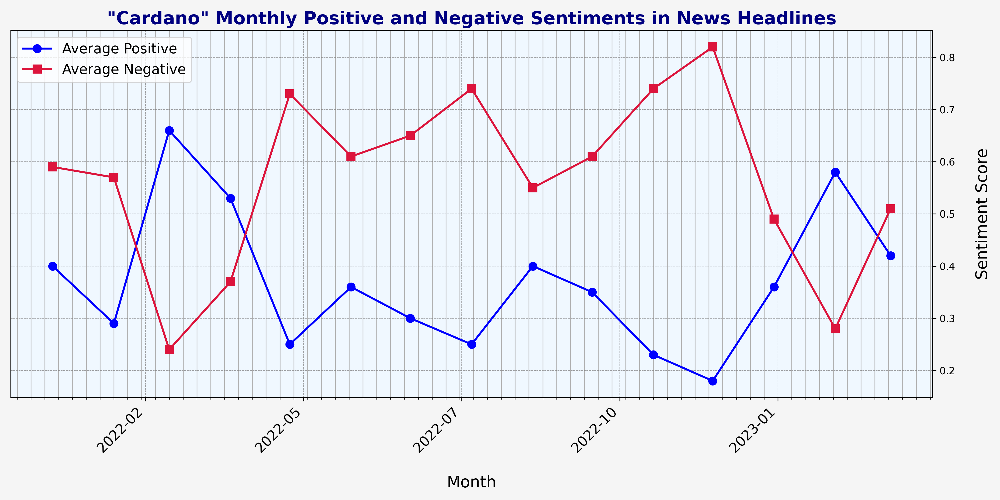
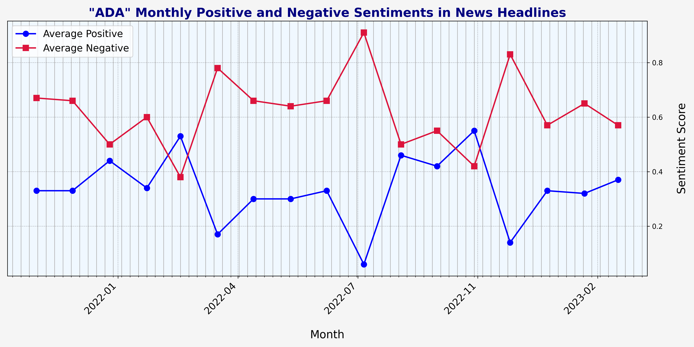

# Cardano AI Sentiment Tracker

## Introduction
Informed decision-making is important for both traders and investors. Although market sentiment trackers are widely used in traditional finance, the Cardano community lacks a dedicated tool designed to analyze the sentiment on topics and projects in its ecosystem. The Cardano AI Sentiment Tracker aims to provide the Cardano community with a reliable sentiment analysis tool tailored to their needs. Driven by artificial intelligence, this tool aims to become comprehensive resource for tracking market sentiments on various topics surrounding the Cardano ecosystem.

This repository contains a Cardano AI Sentiment Tracker prototype, offering an MVP for the full-scale tool's capabilities.

## Repository Contents

- `endpoint.py`: Sets up the Flask application and defines endpoints for the sentiment analysis and keyword filtering services.
- `keywords.py`: The `KeywordFiltering` class is responsible for extracting sentences containing specified keywords.
- `main.py`: The main script that initiates the sentiment analysis process.
- `sentiment.py`: Defines the `SentimentAnalysis` class, which utilizes a pre-trained sentiment model to perform sentiment analysis. This model is just for demo purposes since the final model will contain much more powerful models fine-tuned to relevant data.
- `test_endpoints.py`: Provides test cases to ensure the Flask endpoints function as expected.
- `test_sentiment.py` is a script for testing sentiment analysis on a dataset of news headlines related to Cardano.
- `Cardano_monthly_sentiments.csv`: Demo of aggregated sentiment scores organized by month.
- `Cardano_sentiment_scores_plot.png`: A plot displaying the sentiment scores.

Make sure the Flask server is running before performing the tests.
```bash
python main.py
```

### Endpoint Testing

To test the Flask application endpoints, run the following:

```bash
python test_endpoints.py
```

### Sentiment Analysis Testing

Use the `test_sentiment.py` script to perform sentiment analysis on the provided dataset:

```bash
python test_sentiment.py
```

### Visualization Demo

The prototype sentiment analysis results are visualized in the following plots:





This plot illustrates the monthly positive and negative sentiment scores.
